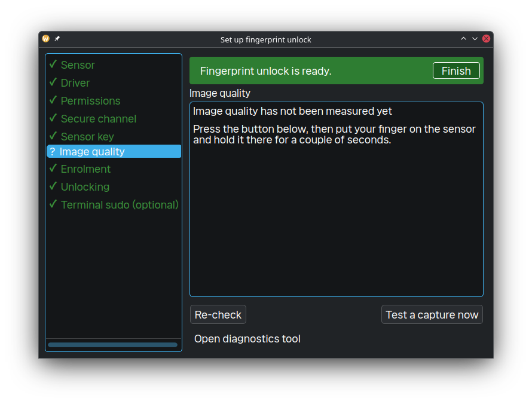
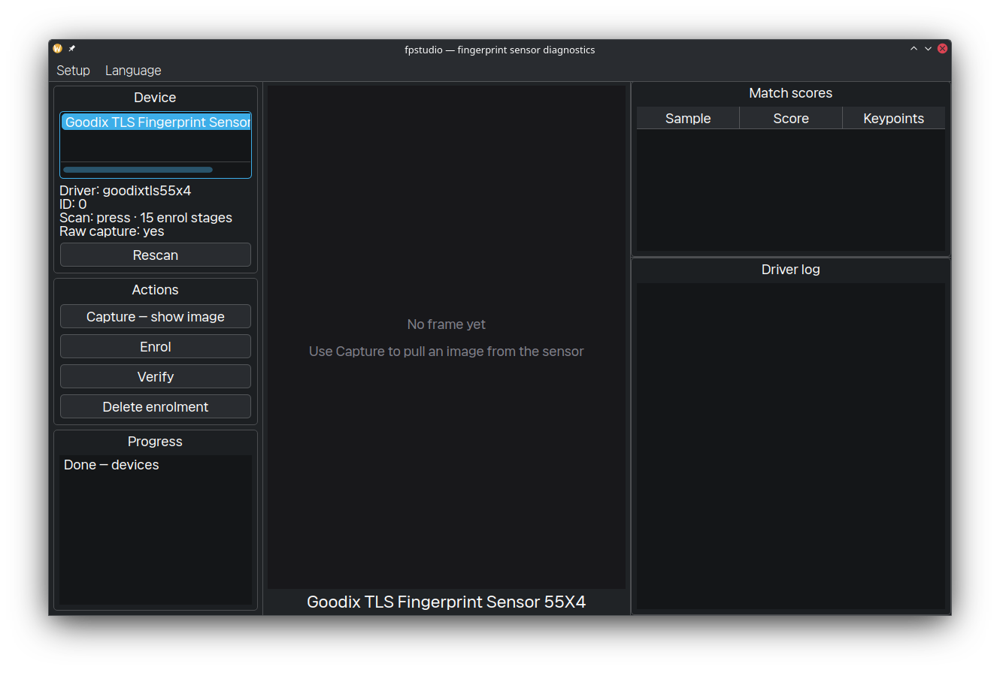

# FPStudio for Goodix 27c6:55b4

[](https://github.com/jedclub/fpstudio-goodix-55b4/actions/workflows/ci.yml)
[](https://github.com/jedclub/fpstudio-goodix-55b4/releases/latest)
[](LICENSE)
[](https://archlinux.org/)
[](https://isocpp.org/)

**FPStudio** is a local-first Linux setup, diagnostics and fingerprint-research
toolkit for the **Goodix 27c6:55b4** reader found in several ThinkPad L14/L15
Gen 1 systems. It packages a patched `libfprint` build recipe alongside a Qt 6
application that guides device checks, collection, enrolment and reversible
authentication setup.

> [!WARNING]
> This is hardware-specific, experimental software. A failing fingerprint
> attempt must always retain a password path. Never publish fingerprint images,
> templates, device secrets, local research sessions or system-authentication
> backups.

## At a glance

| Guided setup | Local diagnostics |
|---|---|
|  |  |
| Check the sensor, patched driver, permissions and enrolment path step by step. | Inspect device state, invoke safe diagnostics and choose the UI language. |

The screenshots contain no biometric samples. Real capture data is deliberately
kept outside version control.

## What it provides

- **One setup wizard** for sensor discovery, driver prerequisites, permissions,
  standard enrolment and opt-in system integration.
- **Live collection guidance** that derives stable candidates from the video
  stream rather than treating one arbitrary frame as a result.
- **Vulkan-assisted research matching** with contact anchors, ridge-region
  checks, bounded rotation and ±5% uniform-scale search. The coloured preview
  makes comparison evidence and uncertain alignment visible.
- **Privacy-local research sessions**. Biometric frames and templates belong in
  `local-private/`, which is excluded from Git.
- **Eleven UI languages**: English, Korean, Japanese, Simplified/Traditional
  Chinese, Spanish, German, French, Russian, Italian and Portuguese.
- **Safe authentication boundary**: password fallback remains available;
  GPU-assisted system authentication is experimental and must be explicitly
  installed and verified by the machine owner.

## Requirements

- Arch Linux or an Arch-derived distribution for the driver package recipe.
- Goodix `27c6:55b4` hardware (`lsusb -d 27c6:`).
- Qt 6.5+, CMake, Ninja, Vulkan headers/loader and `glslangValidator` to build
  FPStudio.
- A patched `libfprint` package from this repository; install `fprintd` only
  after the driver package.

## Quick start

```bash
git clone https://github.com/jedclub/fpstudio-goodix-55b4.git
cd fpstudio-goodix-55b4

# 1. Build and install the pinned, patched libfprint package.
cd src/driver
makepkg -s --needed -f
sudo pacman -U libfprint-goodixtls-55x4-fixed-*.pkg.tar.zst
sudo pacman -S --needed fprintd
cd ../..

# 2. Build FPStudio and run its test suite.
cmake -S src/fpstudio -B build -G Ninja
cmake --build build
ctest --test-dir build --output-on-failure

# 3. Open the setup wizard.
./build/fpstudio
```

The GUI resolves its language from `--lang`, a remembered user choice, then
the system locale. For example, start in English with:

```bash
./build/fpstudio --lang en
```

## Security and privacy model

- **No biometrics in this repository or release assets.** The ignore rules
  exclude local research material, PGM frames, fingerprint templates, build
  trees, credentials and local coding-agent state.
- **No firmware blob is shipped.** The repository contains source probes and
  build instructions only.
- **System changes are explicit and reversible.** The wizard separates checks
  from installation and preserves the password fallback. It does not alter
  login authentication.
- **Research is not a security claim.** A high matcher score or consistent
  ridge pattern is not proof of identity, FAR, FRR or production readiness.

## Release contents

Each tagged release publishes a source archive and SHA-256 checksum. It does
not publish a prebuilt fingerprint driver: recipients build the pinned source
with the supplied patches on their own Arch system. This keeps the driver,
runtime dependencies and local security policy visible and reviewable.

The current driver source revision is
[`c1937b99ec3db5abca05f619a95d2e37496d8810`](https://github.com/TheWeirdDev/libfprint/commit/c1937b99ec3db5abca05f619a95d2e37496d8810).

## Development and CI

```bash
cmake -S src/fpstudio -B build -G Ninja
cmake --build build
ctest --test-dir build --output-on-failure
```

Pull requests and `main` changes run privacy checks, driver package builds,
translation checks, a full CTest run and a release-readiness check. Pushing a
`v*` tag builds a source archive, writes its checksum and publishes the
matching release note from `docs/releases/`.

## Documentation

- [Setup guide](docs/00-setup.md)
- [Driver implementation notes](docs/03-driver.md)
- [FPStudio architecture](docs/04-fpstudio.md)
- [Recognition and research workflow](docs/07-recognition.md)
- [Vulkan matching design](docs/11-vulkan-matching.md)
- [Contact-anchored v8 matcher](docs/20-contact-anchored-rotation-v8.md)
- [v0.2.4 release notes](docs/releases/v0.2.4.md)

## Licence and third-party code

FPStudio and its Goodix/libfprint-derived driver patches are licensed under
the **GNU Lesser General Public License, version 2.1 or later**. See
[LICENSE](LICENSE) and [THIRD_PARTY_NOTICES.md](THIRD_PARTY_NOTICES.md).

The driver build recipe retrieves the LGPL `libfprint` Goodix TLS fork at a
pinned revision. If you redistribute a modified driver binary, you must also
provide the corresponding source, patches, licence text and copyright notices.
