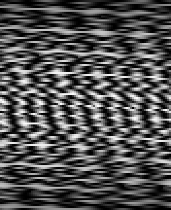

# goodix-55b4-linux

Fingerprint unlock on Linux for the **Goodix 27c6:55b4** sensor — the reader in
the ThinkPad L14/L15 Gen 1, which upstream `libfprint` does not support.

A patched driver, and one application that installs it, checks it, enrols a
finger, and wires it into `polkit`, `sudo`, and the lock screen.


---

## Status

| | |
|---|---|
| Device recognised | ✅ `Goodix TLS Fingerprint Sensor 55X4`, driver `goodixtls55x4` |
| TLS session | ✅ after writing the all-zero PSK (irreversible — see below) |
| Raw capture | ✅ 108×88, 8-bit, clean ridge detail |
| Enrolment | ✅ 15 stages, with a quality gate that rejects half-landed scans |
| Verification | ✅ passing scores 77–2920 against a threshold of 72 |
| Unlocking | ✅ `pkexec` / desktop prompts, `sudo`, lock screen |

Measured over seven verify attempts on real hardware: five matched. The two
misses scored 0 and 7 — placements that did not overlap any enrolled sample,
not weak readings. The PAM stacks this ships allow 20 tries, which is what
makes that per-touch rate usable in practice.

## Requirements

- Arch Linux or a derivative (the driver ships as a `PKGBUILD`)
- A Goodix `27c6:55b4` sensor — check with `lsusb -d 27c6:`
- `fprintd`, and Qt 6 to build the tool

## Quick start

```bash
git clone <this repo> && cd goodix-55b4-linux

# 1. Driver (replaces the system libfprint)
cd src/driver && makepkg -f
sudo pacman -U libfprint-goodixtls-55x4-fixed-*.pkg.tar.zst
sudo pacman -S fprintd          # after the driver, never before

# 2. The tool
cmake -S src/fpstudio -B build && cmake --build build

# 3. Everything else
./build/fpstudio
```

The wizard checks nine things, fixes what it can, and says plainly what it
cannot do for you. It shows the exact commands before running any of them.

> **`fprintd` must be installed after the driver.** Installing it first pulls
> in the stock `libfprint` and undoes step 1.

## The tool

One binary, four front ends over the same engine:

```
fpstudio                setup wizard - the default
fpstudio --diagnostics  live capture, driver log, match scores
fpstudio --cli setup    what is configured, as JSON
fpstudio --mcp          MCP server, for an agent
```


Available in 11 languages — English, 한국어, 日本語, 简体中文, 繁體中文,
Español, Deutsch, Français, Русский, Italiano, Português. It follows the
system locale and falls back to English; `--lang` overrides it.

## What was wrong, and what fixed it

Three findings did the work. All three are documented with the measurements
behind them in [`docs/05-geometry-regression.md`](docs/05-geometry-regression.md).

**A one-byte allocation bug upstream** (`0005`). `err_from_ssl()` allocated
`strlen(msg)` instead of `strlen(msg) + 1`, so the process died the moment it
tried to report *any* SSL failure. Fixing it is what made the real errors
visible at all.

**The row length** (`0006`). `goodix-fp-dump` and the vendor's own `Wbdi.dll`
table both say this die is 88×108, and both are right — about the die. The
sensor emits whatever window the uploaded MCU config asks it to scan, and that
config is the GF3268's, so it emits 108-wide rows. Cutting at 88 sheared the
image a little further every row.

| Cut at 108 (correct) | Cut at 88 |
|---|---|
|  |  |

**The normalisation** (`0009`). `squash_frame_linear` stretched min-to-max, so
the part of the window the finger never touched pinned the black point and the
ridges were squeezed into the top of the range — every capture had a 1st
percentile of 0 and a median of 122–189. Stretching the 2nd–98th percentile of
the live area instead took the match score on two overlapping captures from 5
to 63, against a threshold of 72.

| min/max (before) | percentile (after) |
|---|---|
|  |  |

*(Those four images are synthetic — a generated ridge field put through the
same two failures. No real fingerprint is committed to this repository.)*

## Repository layout

```
docs/            how the device was identified, what was tried, what was ruled out
  00-setup.md      the whole procedure, start to finish
  05-geometry...   what the 0/72 failure actually was
  evidence/        facts extracted from the vendor's Windows driver
src/
  driver/        12 patches against the libfprint goodixtls fork, plus a PKGBUILD
  fpstudio/      the C++/Qt6 application
    pam/         polkit, sudo and lock-screen stacks
  firmware/      read-only probes, and the one write (PSK) this needed
captures/        synthetic illustrations only
```

## Before you start: the irreversible step

If the TLS handshake fails, the sensor needs the all-zero PSK written to it.
**This cannot be undone.** The key the sensor currently holds cannot be read
back — the protocol returns a value derived from it, not the key — so there is
no backup to restore, and **Windows fingerprint sign-in stops working on that
machine permanently.**

If you dual-boot and use it there, stop before that step. The wizard makes you
type the word `WRITE` rather than click past it.

## What this does to your system's authentication

Three PAM stacks, each installed separately and each reversible by deleting one
file:

| File | Effect | Default |
|---|---|---|
| `/etc/pam.d/polkit-1` | `pkexec` and desktop prompts accept a fingerprint | installed by the wizard |
| `/etc/pam.d/kde-fingerprint` | lock screen retries 20× instead of 3× | optional |
| `/etc/pam.d/sudo` | terminal `sudo` accepts a fingerprint | **opt-in** |

Every one uses `sufficient`, so a fingerprint that fails for any reason —
unplugged sensor, broken driver, no enrolment — falls through to the password
prompt exactly as before. Login is deliberately never touched: a sensor that
stops working can never lock you out of the machine.

`sudo` is opt-in and separate because it is itself the way back in when
something else breaks.

## Known limits

- **About 70% per touch.** The window is roughly 5.5 × 4.5 mm, so a placement
  that misses every enrolled sample scores nothing. Twenty retries is what
  makes this a non-issue in practice, not a better matcher.
- **Image quality is not calibrated per die.** The driver uploads one fixed MCU
  config and never reads the chip's OTP, where the DAC and tcode values live.
  Command `0xa6` returns 32 bytes — the MCU's own OTP, not that one — and
  sweeping the sensor's register space to `0x8000` did not find the other.
  Reaching it means decoding the vendor's bit-banged SPI sequence.
- **Terminal prompts have no progress indication.** `pam_fprintd` prints a line
  per failed scan and nothing while it waits. That module is the distribution's,
  not this project's.

## Documentation

| | |
|---|---|
| [`00-setup.md`](docs/00-setup.md) | the whole procedure, and what to check at each step |
| [`01-investigation.md`](docs/01-investigation.md) | how the device was identified |
| [`02-device.md`](docs/02-device.md) | measured values from this hardware |
| [`03-driver.md`](docs/03-driver.md) | the patches, and how to rebuild |
| [`04-fpstudio.md`](docs/04-fpstudio.md) | the tool's design |
| [`05-geometry-regression.md`](docs/05-geometry-regression.md) | the `0/72` failure, measured |
| [`06-system-integration.md`](docs/06-system-integration.md) | fprintd, PAM, and why they are separate |

## Licence

LGPL-2.1, matching `libfprint`. See [`LICENSE`](LICENSE).
